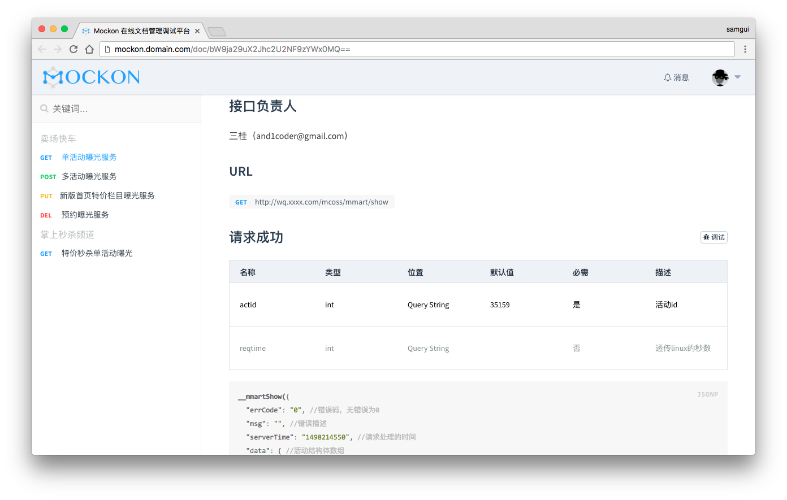
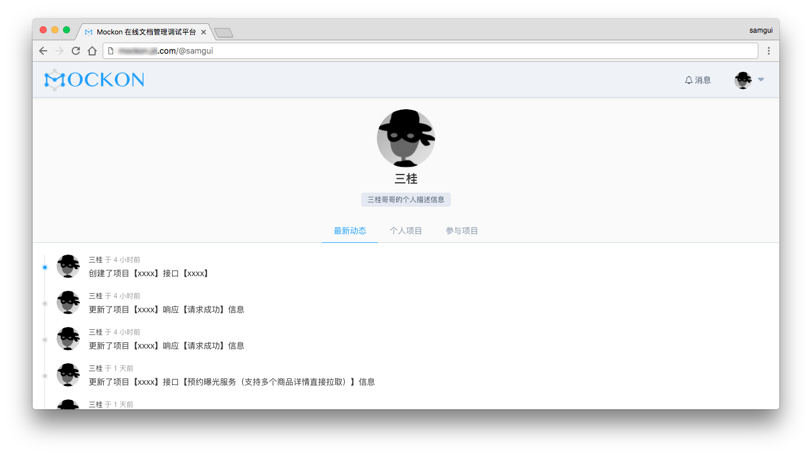

# Mockon
## An API documents and mock platform

### Technology stack

### Server(RESTful API)

- [ThinkJS 2.0](http://www.thinkjs.org)
- [JsonWebToken](https://github.com/auth0/node-jsonwebtoken)
- [GraphQL](https://github.com/facebook/graphql)

### Client(SPA)
- [Vue 2.0](https://github.com/vuejs/vue)
- [Vuex](https://github.com/vuejs/vuex)
- [Element](https://github.com/ElemeFE/element)

### Architecture

### Screenshots

